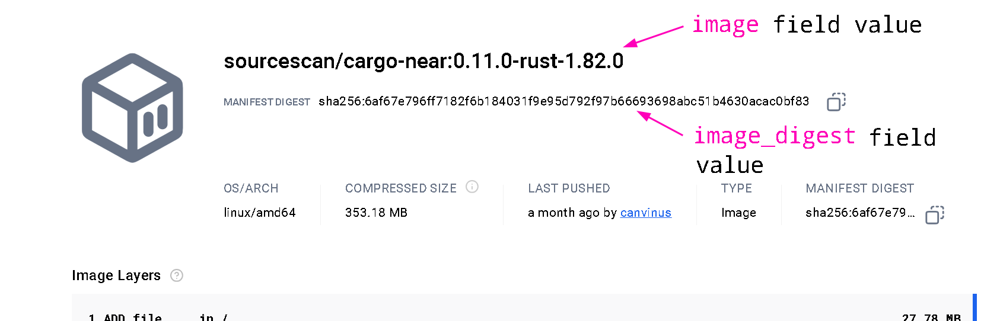

<!-- markdownlint-disable MD014 -->

<div align="center">

  <h1><code>cargo-near</code></h1>

  <p>
    <strong>Cargo extension for building <a href="https://github.com/near/near-sdk-rs">near-sdk-rs</a> smart contracts and <a href="https://github.com/near/abi">ABI schemas</a> on NEAR</strong>
  </p>

  <p>
    <a href="https://github.com/near/cargo-near/actions/workflows/test.yml?query=branch%3Amain"></a>
    <a href="https://crates.io/crates/cargo-near"></a>
    <a href="https://crates.io/crates/cargo-near"></a>
  </p>

</div>

## Release notes

**Release notes and unreleased changes can be found in the [CHANGELOG](CHANGELOG.md)**

## Installation

<details>
  <summary>Install prebuilt binaries via shell script (Linux, macOS)</summary>

```sh
curl --proto '=https' --tlsv1.2 -LsSf https://github.com/near/cargo-near/releases/latest/download/cargo-near-installer.sh | sh
```
</details>

<details>
  <summary>Install prebuilt binaries via powershell script (Windows)</summary>

```sh
irm https://github.com/near/cargo-near/releases/latest/download/cargo-near-installer.ps1 | iex
```
</details>

<details>
  <summary>Install prebuilt binaries into your Node.js application</summary>

```sh
npm install cargo-near
```
</details>

<details>
  <summary>Compile and install from source code (Cargo)</summary>

```sh
cargo install --locked cargo-near
```

or, install the most recent version from git repository:

```sh
$ git clone https://github.com/near/cargo-near
$ cargo install --locked --path cargo-near
```
</details>

## Usage

See `cargo near --help` for a complete list of available commands or run `cargo near` to dive into interactive mode. Help is also available for each individual command with a `--help` flag, e.g. `cargo near build --help`.

```console
cargo near
```

Starts interactive mode that will allow to explore all the available commands.

---
Use `--teach-me` flag if you want to know "how it works".

```console
cargo near --teach-me
```

Starts an interactive mode with an explanation of the execution of the selected command.

---
Additionally depends on [Git](https://git-scm.com/) binary being installed, besides [cargo](https://github.com/rust-lang/cargo).

```console
cargo near new
```

Initializes a new project skeleton to create a contract from a template.

[Example](./docs/workflows.md) of github [workflows](./cargo-near/src/commands/new/new-project-template/.github/workflows) configuration, created by `cargo near new`.

---

```console
cargo near build
```

Builds a NEAR smart contract along with its [ABI](https://github.com/near/abi) (while in the directory containing contract's Cargo.toml).

Running the above command opens a menu with following variants: 

### `non-reproducible-wasm`

This is a regular build, which behaves much like and is a thin wrapper around a regular `cargo build --target wasm32-unknown-unknown --release`.

Additional flags for build configuration can be looked up by

```bash
cargo near build non-reproducible-wasm --help
```
if needed.

### `reproducible-wasm`

This variant runs a reproducible build in a [Docker](https://docs.docker.com/) container, which:

1. runs against source code version, committed to git, ignoring any uncommitted changes
2. requires that `Cargo.lock` of project is created (e.g. via `cargo update`) and added to git. 
    - this enables `--locked` build by downstream `cargo` command. 
3. will use configuration in [`[package.metadata.near.reproducible_build]`](https://github.com/near/cargo-near/blob/main/cargo-near/src/commands/new/new-project-template/Cargo.template.toml#L14-L25) 
   section of contract's `Cargo.toml` and [`package.repository`](https://github.com/near/cargo-near/blob/main/cargo-near/src/commands/new/new-project-template/Cargo.template.toml#L9) field
    - default values for this section can also be found in `Cargo.toml` of 
      template project, generated by `cargo near new`

**What's a reproducible build in context of NEAR?**
Why is it needed? Explanation of these points and a step-by-step tutorial is present at [SourceScan/verification-guide](https://github.com/SourceScan/verification-guide).

<details>
  <summary>Additional (optional) details on possible <code>[package.metadata.near.reproducible_build]</code> configuration</summary><p>
  
1. available images can be found by this link https://hub.docker.com/r/sourcescan/cargo-near/tags 
  - [`image`](https://github.com/near/cargo-near/blob/main/cargo-near/src/commands/new/new-project-template/Cargo.template.toml#L18) and [`image_digest`](https://github.com/near/cargo-near/blob/main/cargo-near/src/commands/new/new-project-template/Cargo.template.toml#L19) are straightforward to configure:
  
2. build command flags can be configured, if needed, by changing [`container_build_command`](https://github.com/near/cargo-near/blob/main/cargo-near/src/commands/new/new-project-template/Cargo.template.toml#L29) field
  - base `container_build_command` for images prior to **sourcescan/cargo-near:0.13.0-rust-1.83.0** is `["cargo", "near", "build"]` 
  - base `container_build_command` for images starting with **sourcescan/cargo-near:0.13.0-rust-1.83.0** and after it  is `["cargo", "near", "build", "non-reproducible-wasm", "--locked"]`, where the `--locked` flag is required
  - additional flags, if needed, can be looked up on
    - `cargo near build non-reproducible-wasm --help` for newer/latest images 
    - `cargo near build --help` for older ones 
    - running `docker run -it sourcescan/cargo-near:0.11.0-rust-1.82.0` (or another specific image) and checking the `--help` message of exact `cargo-near` in container may be helpful when in doubt    
3. `cargo near` allows parameterizing build with values of environment variables, present at the time of the build and not present in a contract's source code,
   by specifying their names in [`passed_env`](https://github.com/near/cargo-near/blob/main/cargo-near/src/commands/new/new-project-template/Cargo.template.toml#L24) array
  - supported by `sourcescan/cargo-near:0.10.1-rust-1.82.0` image or later images
  - SourceScan/Nearblocks does not support verifying such contracts yet. 

</p></details>

---

```console
cargo near abi
```

Generates NEAR smart contract's [ABI](https://github.com/near/abi) (while in the directory containing contract's Cargo.toml).

Once contract is deployed, this will allow you to call a view function `__contract_abi` to retrieve a [ZST](https://facebook.github.io/zstd/)-compressed ABI.

---

```console
cargo near create-dev-account
```

Guides you through creation of a new NEAR account on [testnet](https://explorer.testnet.near.org).

---

```console
cargo near deploy
```

Builds the smart contract (equivalent to `cargo near build`) and guides you to deploy it to the blockchain.

Similar to `build`, running the above command opens a menu with following variants: 

### `build-non-reproducible-wasm`

This forwards to [non-reproducible-wasm](#non-reproducible-wasm) variant of `build` command.

### `build-reproducible-wasm`

This forwards to [reproducible-wasm](#reproducible-wasm) variant of `build` command.

`deploy` command from Docker build requires that contract's source code:

1. doesn't have any modified tracked files, any staged changes or any untracked content.  
2. has been pushed to remote repository, identified by 
   [`package.repository`](https://github.com/near/cargo-near/blob/main/cargo-near/src/commands/new/new-project-template/Cargo.template.toml#L9).


## Contribution

Unless you explicitly state otherwise, any contribution intentionally submitted
for inclusion in the work by you, as defined in the Apache-2.0 license, shall be
dual licensed as below, without any additional terms or conditions.

## License

Licensed under either of

* Apache License, Version 2.0
   ([LICENSE-APACHE](LICENSE-APACHE) or <http://www.apache.org/licenses/LICENSE-2.0>)
* MIT license
   ([LICENSE-MIT](LICENSE-MIT) or <http://opensource.org/licenses/MIT>)

at your option.
