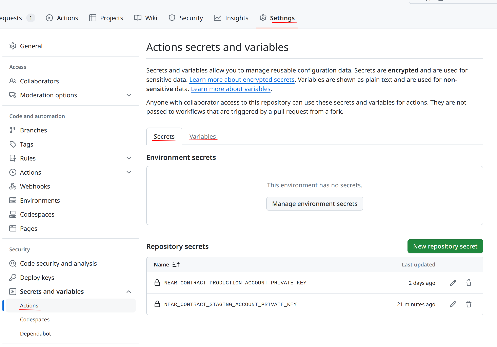

Example production account values: 

```bash
# variables
NEAR_CONTRACT_PRODUCTION_ACCOUNT_ID=cargo_near_test_workflows.testnet
NEAR_CONTRACT_PRODUCTION_NETWORK=testnet
# secrets
NEAR_CONTRACT_PRODUCTION_ACCOUNT_PRIVATE_KEY=ed25519:4diBhcs9ECg3sDPE97gCFhHbB21BSRheWSzrqt1UVciEoMhpecnFjqapeSfrxxxxxxxxxxxxxxxxxxxxxxxxxxxx
```

Example staging account values:

```bash
# variables
NEAR_CONTRACT_STAGING_ACCOUNT_PUBLIC_KEY=ed25519:EvCRvguSjeaTGuzQPQmLg1GqWLqgihBKKcSHT4xtS8K
NEAR_CONTRACT_STAGING_ACCOUNT_ID=cargo_near_test_workflows.testnet
NEAR_CONTRACT_STAGING_NETWORK=testnet
# secrets
NEAR_CONTRACT_STAGING_ACCOUNT_PRIVATE_KEY=ed25519:4diBhcs9ECg3sDPE97gCFhHbB21BSRheWSzrqt1UVciEoMhpecnFjqapeSfrxxxxxxxxxxxxxxxxxxxxxxxxxxxx
```

NOTE: last chars of both private keys examples are redacted/replaced with `'x'` char. 

**WARNING**: this simple setup isn't expected to work with pull requests
from forks for deploy/undeploy to per-PR staging accounts, as workflows triggered by PRs from forks
don't have access to forked repository's variables. 
